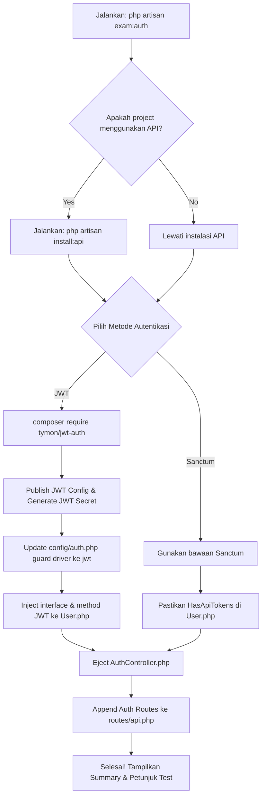

# 🥾 Laravel Exam Boots


> **CLI Component & Auth Generator** untuk ujian sertifikasi programming — hemat hingga **90% waktu setup** dengan boilerplate arsitektur modern (Model, Migration, Controller, Service, Request, Resource, dan Sistem Autentikasi API) yang langsung di-*eject* ke dalam project Laravel kamu.

Mengadopsi filosofi **shadcn/ui**: bukan library blackbox, melainkan menyuntikkan kode boilerplate langsung ke `app/` dan `database/` agar kamu bisa langsung edit dan kustomisasi sesuai kebutuhan ujian.

---

## 📑 Daftar Isi

- [Tentang Project](#-tentang-project)
- [Requirements](#-requirements)
- [Instalasi](#-instalasi)
- [Fitur Utama](#-fitur-utama)
- [Quick Start](#-quick-start)
- [Referensi Command CLI](#-referensi-command-cli)
  - [Command 1: `php artisan exam:add {name}`](#command-1-php-artisan-examadd-name)
  - [Command 2: `php artisan exam:auth`](#command-2-php-artisan-examauth)
- [Contoh Kode yang Dihasilkan](#-contoh-kode-yang-dihasilkan)
- [Arsitektur](#-arsitektur)
- [Kustomisasi](#-kustomisasi)
- [Setelah Generate: Langkah Selanjutnya](#-setelah-generate-langkah-selanjutnya)
- [FAQ & Troubleshooting](#-faq--troubleshooting)
- [Contributing](#-contributing)
- [Lisensi](#-lisensi)

---

## 🎯 Tentang Project

**Laravel Exam Boots** adalah sebuah Laravel Package yang menyediakan Artisan CLI command interaktif untuk mempercepat pengerjaan modul CRUD dan Autentikasi selama ujian sertifikasi.

### Kenapa Package Ini?

| Tanpa Exam Boots | Dengan Exam Boots |
|---|---|
| Buat Model, Migration, Controller, Service, Request, Resource manual ~25 menit | ✅ Generate 6 file sekaligus dalam **< 10 detik** |
| Setup JWT/Sanctum auth + route + controller manual ~30 menit | ✅ Setup sistem autentikasi lengkap dengan **`php artisan exam:auth`** |
| Copy-paste boilerplate rawan typo | ✅ Template terstandarisasi, zero typo |
| Struktur folder inconsistent | ✅ Arsitektur Controller-Service-Resource konsisten |

---

## 📋 Requirements

| Requirement | Versi |
|---|---|
| PHP | `^8.3` (menggunakan `readonly class` dari PHP 8.2+) |
| Laravel | `^13.x` (latest) |
| Composer | `^2.9.5` |

---

## 🚀 Instalasi

### 1. Install via Composer

```bash
composer require gani/laravel-exam-boots
```

### 2. Auto-Discovery (Otomatis)

Package ini menggunakan Laravel Package Auto-Discovery, sehingga **tidak perlu register ServiceProvider manual**. Setelah `composer require`, command `exam:add` dan `exam:auth` langsung tersedia.

### 3. Verifikasi Instalasi

```bash
php artisan list | grep exam
```

Output yang diharapkan:
```
exam:add    Generate CRUD boilerplate components (Model, Migration, Controller, Service, Request, Resource)
exam:auth   Setup authentication system (JWT / Sanctum) with Login, Register, Logout
```

---

## ✨ Fitur Utama

1. **Full-Boilerplate Ejection (`exam:add`)**: Menghasilkan Model, Migration, Form Request, API Resource, Readonly Service, dan Controller dalam sekali jalan.
2. **Interactive Authentication (`exam:auth`)**:
   - Pilihan JWT (menggunakan `tymon/jwt-auth`) atau Laravel Sanctum.
   - Pilihan otomatis instalasi API scaffolding (`php artisan install:api`).
   - Konfigurasi guard otomatis pada `config/auth.php`.
   - Modifikasi User Model (`app/Models/User.php`) otomatis untuk mendukung JWT/Sanctum.
   - Pembuatan `AuthController` lengkap dengan endpoint Register, Login, Logout, dan Me.
   - Pendaftaran route autentikasi otomatis pada `routes/api.php`.
3. **Idempotency (Safe Overwrite)**: Selalu konfirmasi sebelum menimpa file yang sudah ada.
4. **Cross-OS Compatibility**: Menggunakan `File::ensureDirectoryExists()` untuk kompatibilitas Windows dan Linux.

---

## ⚡ Quick Start

### 1. Setup Autentikasi Terlebih Dahulu

```bash
php artisan exam:auth
```
- CLI akan mendeteksi apakah API sudah terinstall. Jika belum, ia akan menawarkan instalasi API.
- Pilih metode autentikasi yang diinginkan: **JWT** atau **Laravel Sanctum**.
- Semua konfigurasi, model, controller, dan routes akan disetup secara instan.

### 2. Buat Komponen CRUD Baru

```bash
php artisan exam:add Product
```
- Pilih opsi **Eloquent CRUD** atau **Blank Service**.
- Komponen Product (Model, Migration, Controller, Service, Request, Resource) langsung terbuat.

---

## 📖 Referensi Command CLI

### Command 1: `php artisan exam:add {name}`

Menghasilkan file Model, Migration, Controller, Service, Request, dan Resource.

#### Argumen
- `name`: Nama komponen (misalnya: `Product`, `OrderItem`). Otomatis dikonversi ke PascalCase untuk kelas, camelCase untuk variabel, dan snake_case plural untuk tabel database.

#### Contoh Alur Interaktif
```
┌ Generating CRUD boilerplate for: Product
│
├ Apakah fitur ini membutuhkan Auth Middleware? (yes/no)
│ > yes
│
├ Pilih tipe database operation:
│ > Eloquent CRUD
│
├ INFO  Created: Product.php
├ INFO  Created: 2026_07_14_141849_create_products_table.php
├ INFO  Created: ProductController.php
├ INFO  Created: ProductService.php
├ INFO  Created: ProductRequest.php
├ INFO  Created: ProductResource.php
│
┌───────────┬────────────────────────────────────────────────────────┬────────────┐
│ Component │ File                                                   │ Status     │
├───────────┼────────────────────────────────────────────────────────┼────────────┤
│ Model     │ app/Models/Product.php                                 │ ✅ Created │
│ Migration │ database/migrations/2026_07_14_141849_create_products...│ ✅ Created │
│ Controller│ app/Http/Controllers/ProductController.php             │ ✅ Created │
│ Service   │ app/Services/ProductService.php                        │ ✅ Created │
│ Request   │ app/Http/Requests/ProductRequest.php                   │ ✅ Created │
│ Resource  │ app/Http/Resources/ProductResource.php                 │ ✅ Created │
└───────────┴────────────────────────────────────────────────────────┴────────────┘
```

---

### Command 2: `php artisan exam:auth`

Menyiapkan sistem autentikasi API lengkap secara interaktif.

#### Alur Flowchart `exam:auth`


---

### Command 3: `php artisan exam:response`

Menghasilkan file Trait helper untuk standarisasi JSON API response (`app/Traits/ApiResponse.php`).

#### Detail Respon & Parameter Opsional
Jika dipanggil, method helper akan mengembalikan format standard yang seragam. Seluruh parameter bisa dikosongkan (optional).

```php
// Success Response
return $this->successResponse($data, $message, $code);

// Error Response
return $this->errorResponse($message, $code, $data);
```

---

## 💻 Contoh Kode yang Dihasilkan

### 1. Model & Migration (`exam:add`)
Model yang dihasilkan dilengkapi dengan properti standar Laravel, siap untuk kamu isi bagian `$fillable`-nya.
Migration file langsung memetakan nama tabel ke format snake_case plural (misal: `Product` -> `products`).

### 2. JWT AuthController (`exam:auth`)
Berisi method pendaftaran, login, logout, refresh token, dan informasi profil dengan guard `auth:api`.

### 3. Sanctum AuthController (`exam:auth`)
Menggunakan personal access tokens (`createToken('auth_token')->plainTextToken`) dan guard `auth:sanctum`.

---

## 🏗️ Arsitektur

### Struktur Package (Generator & Stubs)
```
src/
├── Console/
│   ├── ExamAddCommand.php              # CLI Generator CRUD
│   ├── ExamAuthCommand.php             # CLI Generator Auth
│   └── ExamResponseCommand.php         # CLI Generator Response Trait
├── stubs/
│   ├── controller.stub                 # Eloquent CRUD Controller
│   ├── controller.blank.stub           # Blank Controller
│   ├── service.stub                    # Eloquent CRUD Service
│   ├── service.blank.stub              # Blank Service
│   ├── request.stub                    # Form Request
│   ├── resource.stub                   # API Resource
│   ├── model.stub                      # Eloquent Model
│   ├── migration.stub                  # Migration database
│   ├── auth-controller.jwt.stub        # AuthController (JWT)
│   ├── auth-controller.sanctum.stub    # AuthController (Sanctum)
│   ├── auth-user.jwt.stub              # Model User (JWT)
│   ├── auth-user.sanctum.stub          # Model User (Sanctum)
│   ├── auth-routes.jwt.stub            # Routes API (JWT)
│   ├── auth-routes.sanctum.stub        # Routes API (Sanctum)
│   └── api-response-trait.stub         # API Response Trait helper
└── ExamStarterServiceProvider.php      # Laravel Auto-discovery & Command registration
```

---

## 📝 Setelah Generate: Langkah Selanjutnya

Setelah setup CRUD dan Auth, ikuti langkah berikut untuk menguji API:

1. **Jalankan Migration**:
   ```bash
   php artisan migrate
   ```
2. **Daftarkan Route CRUD**:
   Buka `routes/api.php` dan daftarkan route resource kamu:
   ```php
   use App\Http\Controllers\ProductController;

   Route::apiResource('products', ProductController::class);
   ```

3. **Uji Endpoint Autentikasi**:
   - **Register**: `POST /api/auth/register` dengan body `name`, `email`, `password`, `password_confirmation`.
   - **Login**: `POST /api/auth/login` dengan body `email`, `password`. Simpan token dari response.
   - **Me**: `GET /api/auth/me` dengan header `Authorization: Bearer {token}`.
   - **Logout**: `POST /api/auth/logout` dengan header `Authorization: Bearer {token}`.

---

## ❓ FAQ & Troubleshooting

### Q: Apa yang harus dilakukan jika class JWTSubject tidak ditemukan setelah setup JWT?
**A**: Pastikan kamu telah menjalankan `composer install` atau `composer update` jika file vendor belum sepenuhnya direfresh.

### Q: Bagaimana cara mereset secret key JWT?
**A**: Jalankan perintah berikut untuk menggenerasi ulang kunci secret JWT di file `.env`:
```bash
php artisan jwt:secret --force
```

---

## 👨‍💻 Author

**Abdul Gani Hadiansyah**

---

<p align="center">
  <strong>🥾 Boots Up, Code Fast, Pass The Exam! 🚀</strong>
</p>
