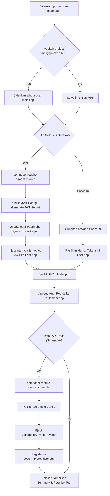

# 🥾 Laravel Exam Boots


> **CLI Component & Auth Generator** untuk ujian sertifikasi programming — hemat hingga **90% waktu setup** dengan boilerplate arsitektur modern (Model, Migration, Controller, Service, Request, Resource, dan Sistem Autentikasi API) yang langsung di-*eject* ke dalam project Laravel kamu.

Mengadopsi filosofi **shadcn/ui**: bukan library blackbox, melainkan menyuntikkan kode boilerplate langsung ke `app/` dan `database/` agar kamu bisa langsung edit dan kustomisasi sesuai kebutuhan ujian.

---

## 📑 Daftar Isi

- [Tentang Project](#-tentang-project)
- [Requirements](#-requirements)
- [Instalasi](#-instalasi)
- [Fitur Utama](#-fitur-utama)
- [Quick Start](#-quick-start)
- [Referensi Command CLI](#-referensi-command-cli)
  - [Command 1: `php artisan exam:add {name}`](#command-1-php-artisan-examadd-name)
  - [Command 2: `php artisan exam:auth`](#command-2-php-artisan-examauth)
- [Contoh Kode yang Dihasilkan](#-contoh-kode-yang-dihasilkan)
- [Arsitektur](#-arsitektur)
- [Kustomisasi](#-kustomisasi)
- [Setelah Generate: Langkah Selanjutnya](#-setelah-generate-langkah-selanjutnya)
- [FAQ &amp; Troubleshooting](#-faq--troubleshooting)
- [Contributing](#-contributing)
- [Lisensi](#-lisensi)

---

## 🎯 Tentang Project

**Laravel Exam Boots** adalah sebuah Laravel Package yang menyediakan Artisan CLI command interaktif untuk mempercepat pengerjaan modul CRUD dan Autentikasi selama ujian sertifikasi.

### Kenapa Package Ini?

| Tanpa Exam Boots                                                               | Dengan Exam Boots                                                       |
| ------------------------------------------------------------------------------ | ----------------------------------------------------------------------- |
| Buat Model, Migration, Controller, Service, Request, Resource manual ~25 menit | ✅ Generate 6 file sekaligus dalam**< 10 detik**                        |
| Setup JWT/Sanctum auth + route + controller manual ~30 menit                   | ✅ Setup sistem autentikasi lengkap dengan**`php artisan exam:auth`** |
| Copy-paste boilerplate rawan typo                                              | ✅ Template terstandarisasi, zero typo                                  |
| Struktur folder inconsistent                                                   | ✅ Arsitektur Controller-Service-Resource konsisten                     |

---

## 📋 Requirements

| Requirement | Versi                                                   |
| ----------- | ------------------------------------------------------- |
| PHP         | `^8.3` (menggunakan `readonly class` dari PHP 8.2+) |
| Laravel     | `^13.x` (latest)                                      |
| Composer    | `^2.9.5`                                              |

---

## 🚀 Instalasi

### 1. Install via Composer

```bash
composer require gani/laravel-exam-boots
```

### 2. Auto-Discovery (Otomatis)

Package ini menggunakan Laravel Package Auto-Discovery, sehingga **tidak perlu register ServiceProvider manual**. Setelah `composer require`, command `exam:add` dan `exam:auth` langsung tersedia.

### 3. Verifikasi Instalasi

```bash
php artisan list | grep exam
```

Output yang diharapkan:

```
exam:add    Generate CRUD boilerplate components (Model, Migration, Controller, Service, Request, Resource)
exam:auth   Setup authentication system (JWT / Sanctum) with Login, Register, Logout
```

---

## ✨ Fitur Utama

1. **Full-Boilerplate Ejection (`exam:add`)**: Menghasilkan Model, Migration, Form Request, API Resource, Service, dan Controller.
   - `--belongsTo=Model`: Menyuntikkan relasi `belongsTo` di model anak, `hasMany` di model induk, dan kolom FK di migration.
   - `--with-factory`: Otomatis membuat ModelFactory dan DatabaseSeeder.
   - `--upload=field`: Menyuntikkan method upload file, validasi tipe/ukuran file, storage put, dan response image URL.
   - `--web`: Menghasilkan views HTML/Blade, Controller berbasis view redirect, dan mendaftarkan route ke `routes/web.php` (bukan API).
   - `--enum=field:val1,val2`: Otomatis men-generate backing Enum class PHP, menyuntikkan casts ke model, dan menyiapkan enum column di migration.
   - `--soft-deletes`: Menyuntikkan trait SoftDeletes ke Model dan `$table->softDeletes()` di migration.
2. **Admin/Default User Seeder (`exam:seed-admin`)**:
   - Menghasilkan `AdminUserSeeder.php` khusus berisi akun admin default dan mendaftarkannya ke `DatabaseSeeder.php` secara otomatis.
3. **Backup & Rollback Infrastructure (`exam:undo`)**:
   - Secara otomatis mem-backup versi file asli sebelum dimodifikasi oleh command package.
   - Perintah `php artisan exam:undo` mengembalikan keadaan project ke kondisi semula dengan menghapus file terbuat dan me-restore file yang termodifikasi.
3. **Global Flags (`--dry-run` & `--force`)**:
   - `--dry-run`: Preview seluruh aksi penulisan file dan modifikasi di terminal tanpa menyentuh filesystem asli.
   - `--force`: Menimpa file existing secara otomatis tanpa menampilkan konfirmasi prompt interaktif.
4. **Configuration File**:
   - Mengatur preferensi default (driver auth default, framework test default, install scramble docs) di file `config/exam-boots.php` untuk mempercepat input prompt interaktif.
5. **Auto Validation Rules Preset**:
   - Otomatis mengisi rules pada Form Request hasil eject sesuai relasi (`exists:table,id`), tipe upload (`image|mimes:jpeg,png...`), dan enum (`Rule::enum()`).

---

## ⚡ Quick Start

### 1. Setup Autentikasi Terlebih Dahulu

```bash
php artisan exam:auth
```

- CLI akan mendeteksi apakah API sudah terinstall. Jika belum, ia akan menawarkan instalasi API.
- Pilih metode autentikasi yang diinginkan: **JWT** atau **Laravel Sanctum**.
- Semua konfigurasi, model, controller, dan routes akan disetup secara instan.

### 2. Buat Komponen CRUD Baru

```bash
php artisan exam:add Product
```

- Pilih opsi **Eloquent CRUD** atau **Blank Service**.
- Komponen Product (Model, Migration, Controller, Service, Request, Resource) langsung terbuat.

---

## 📖 Referensi Command CLI

### Command 1: `php artisan exam:add {name}`

Menghasilkan file Model, Migration, Controller, Service, Request, dan Resource.

#### Argumen

- `name`: Nama komponen (misalnya: `Product`, `OrderItem`). Otomatis dikonversi ke PascalCase untuk kelas, camelCase untuk variabel, dan snake_case plural untuk tabel database.

#### Contoh Alur Interaktif

```
┌ Generating CRUD boilerplate for: Product
│
├ Apakah fitur ini membutuhkan Auth Middleware? (yes/no)
│ > yes
│
├ Pilih tipe database operation:
│ > Eloquent CRUD
│
├ INFO  Created: Product.php
├ INFO  Created: 2026_07_14_141849_create_products_table.php
├ INFO  Created: ProductController.php
├ INFO  Created: ProductService.php
├ INFO  Created: ProductRequest.php
├ INFO  Created: ProductResource.php
│
┌───────────┬────────────────────────────────────────────────────────┬────────────┐
│ Component │ File                                                   │ Status     │
├───────────┼────────────────────────────────────────────────────────┼────────────┤
│ Model     │ app/Models/Product.php                                 │ ✅ Created │
│ Migration │ database/migrations/2026_07_14_141849_create_products...│ ✅ Created │
│ Controller│ app/Http/Controllers/ProductController.php             │ ✅ Created │
│ Service   │ app/Services/ProductService.php                        │ ✅ Created │
│ Request   │ app/Http/Requests/ProductRequest.php                   │ ✅ Created │
│ Resource  │ app/Http/Resources/ProductResource.php                 │ ✅ Created │
└───────────┴────────────────────────────────────────────────────────┴────────────┘
```

---

### Command 2: `php artisan exam:auth`

Menyiapkan sistem autentikasi API lengkap secara interaktif.

#### Alur Flowchart `exam:auth`



---

### Command 3: `php artisan exam:response`

Menghasilkan file Trait helper untuk standarisasi JSON API response (`app/Traits/ApiResponse.php`).

---

### Command 4: `php artisan exam:relation`

Membangun relasi antar model (1:1, 1:N, N:M) secara interaktif, menyuntikkan method relasi ke kedua model, dan membuat file migration (termasuk pivot table dengan cascadeOnDelete).

---

### Command 5: `php artisan exam:policy {Model}`

Membuat file Policy untuk otorisasi model dan mendaftarkannya secara otomatis di `AuthServiceProvider.php`.

---

### Command 6: `php artisan exam:test {Model} {--pest}`

Membuat file feature test CRUD endpoint lengkap menggunakan PHPUnit atau Pest PHP (dengan validasi response structure & route protection).

---

### Command 7: `php artisan exam:export {Model}`

Membuat boilerplate class data export Excel (maatwebsite/excel) dan PDF (barryvdh/laravel-dompdf) beserta template blade view-nya.

---

### Command 8: `php artisan exam:doctor`

Memeriksa konfigurasi server & aplikasi (PHP version, DB connection, JWT secret, APP_KEY, storage symlink, pending migrations) sebelum memulai ujian.

---

### Command 9: `php artisan exam:cheatsheet`

Menampilkan daftar command cepat offline langsung di terminal.

---

### Command 10: `php artisan exam:seed-admin`

Menghasilkan seeder admin default berisi email dan password akun untuk mempermudah pengerjaan login pertama saat testing endpoint, serta meng-auto register seeder tersebut ke dalam kelas `DatabaseSeeder.php`.

---

### Command 11: `php artisan exam:undo {id?}`

Membatalkan / me-rollback operasi generator terakhir. Jika terdapat modifikasi file atau pembuatan file baru, perintah ini akan me-restore file backup asli dan menghapus file baru yang digenerate.

---

### Publish Configuration File

Kamu bisa mempublikasikan file konfigurasi bawaan untuk mengatur preferensi ujian kamu (misalnya default menggunakan Sanctum, Pest, atau status install scramble docs):

```bash
php artisan vendor:publish --tag=exam-boots-config
```

---

## 💻 Contoh Kode yang Dihasilkan

### 1. Model & Migration (`exam:add`)

Model yang dihasilkan dilengkapi dengan properti standar Laravel, siap untuk kamu isi bagian `$fillable`-nya.
Migration file langsung memetakan nama tabel ke format snake_case plural (misal: `Product` -> `products`).

### 2. JWT AuthController (`exam:auth`)

Berisi method pendaftaran, login, logout, refresh token, dan informasi profil dengan guard `auth:api`.

### 3. Sanctum AuthController (`exam:auth`)

Menggunakan personal access tokens (`createToken('auth_token')->plainTextToken`) dan guard `auth:sanctum`.

---

## 🏗️ Arsitektur

### Struktur Package (Generator & Stubs)

```
src/
├── Concerns/
│   └── TracksFileOperations.php        # Trait tracking penulisan file, backup & restore
├── Console/
│   ├── ExamAddCommand.php              # CLI Generator CRUD
│   ├── ExamAuthCommand.php             # CLI Generator Auth
│   ├── ExamCheatsheetCommand.php       # CLI Cheatsheet Offline
│   ├── ExamDoctorCommand.php           # CLI Environment Doctor
│   ├── ExamExportCommand.php           # CLI Export Excel & PDF
│   ├── ExamPolicyCommand.php           # CLI Policy Generator
│   ├── ExamRelationCommand.php         # CLI Relation Generator
│   ├── ExamResponseCommand.php         # CLI ApiResponse Trait Generator
│   ├── ExamSeedAdminCommand.php        # CLI Admin User Seeder Generator
│   ├── ExamTestCommand.php             # CLI Test Generator (PHPUnit/Pest)
│   └── ExamUndoCommand.php             # CLI Rollback/Undo Generator
├── config/
│   └── exam-boots.php                  # Konfigurasi package default
├── stubs/
│   ├── controller.stub                 # Eloquent CRUD Controller
│   ├── controller.blank.stub           # Blank Controller
│   ├── service.stub                    # Eloquent CRUD Service
│   ├── service.blank.stub              # Blank Service
│   ├── request.stub                    # Form Request
│   ├── resource.stub                   # API Resource
│   ├── model.stub                      # Eloquent Model
│   ├── migration.stub                  # Migration database
│   ├── web-controller.stub             # Web MVC Controller stub
│   ├── view-index.stub                 # Blade index view stub
│   ├── view-create.stub                # Blade create view stub
│   ├── view-edit.stub                  # Blade edit view stub
│   ├── view-show.stub                  # Blade show view stub
│   ├── factory.stub                    # Factory stub
│   ├── seeder.stub                     # Seeder stub
│   ├── policy.stub                     # Policy class stub
│   ├── test-phpunit.stub               # PHPUnit test stub
│   ├── test-pest.stub                  # Pest test stub
│   ├── export-excel.stub               # Excel Export class stub
│   ├── export-pdf.stub                 # PDF Export service stub
│   ├── export-pdf-view.stub            # PDF HTML layout stub
│   ├── auth-controller.jwt.stub        # AuthController (JWT)
│   ├── auth-controller.sanctum.stub    # AuthController (Sanctum)
│   ├── auth-user.jwt.stub              # Model User (JWT)
│   ├── auth-user.sanctum.stub          # Model User (Sanctum)
│   ├── auth-routes.jwt.stub            # Routes API (JWT)
│   ├── auth-routes.sanctum.stub        # Routes API (Sanctum)
│   ├── api-response-trait.stub         # API Response Trait helper
│   ├── scramble-provider.jwt.stub      # ScrambleServiceProvider (JWT)
│   └── scramble-provider.sanctum.stub  # ScrambleServiceProvider (Sanctum)
└── ExamStarterServiceProvider.php      # Laravel Auto-discovery & Command registration
```

---

## 📝 Setelah Generate: Langkah Selanjutnya

Setelah setup CRUD dan Auth, ikuti langkah berikut untuk menguji API:

1. **Jalankan Migration**:

   ```bash
   php artisan migrate
   ```
2. **Daftarkan Route CRUD**:
   Buka `routes/api.php` dan daftarkan route resource kamu:

   ```php
   use App\Http\Controllers\ProductController;

   Route::apiResource('products', ProductController::class);
   ```
3. **Uji Endpoint Autentikasi**:

   - **Register**: `POST /api/auth/register` dengan body `name`, `email`, `password`, `password_confirmation`.
   - **Login**: `POST /api/auth/login` dengan body `email`, `password`. Simpan token dari response.
   - **Me**: `GET /api/auth/me` dengan header `Authorization: Bearer {token}`.
   - **Logout**: `POST /api/auth/logout` dengan header `Authorization: Bearer {token}`.
4. **Buka API Documentation** (jika Scramble terinstall):

   Akses di browser: [http://localhost:8000/docs/api](http://localhost:8000/docs/api)

   Scramble akan secara otomatis mendokumentasikan semua route API, termasuk Auth endpoints. Gunakan tombol **Authorize** di halaman docs untuk menguji endpoint yang membutuhkan autentikasi.

---

## ❓ FAQ & Troubleshooting

### Q: Apa yang harus dilakukan jika class JWTSubject tidak ditemukan setelah setup JWT?

**A**: Pastikan kamu telah menjalankan `composer install` atau `composer update` jika file vendor belum sepenuhnya direfresh.

### Q: Bagaimana cara mereset secret key JWT?

**A**: Jalankan perintah berikut untuk menggenerasi ulang kunci secret JWT di file `.env`:

```bash
php artisan jwt:secret --force
```

---

## 👨‍💻 Author

**Abdul Gani Hadiansyah**

---

<p align="center">
  <strong>🥾 Boots Up, Code Fast, Pass The Exam! 🚀</strong>
</p>
